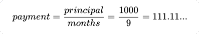
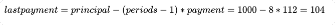
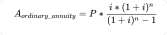
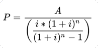
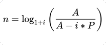
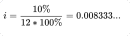
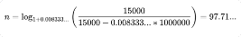
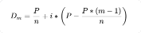
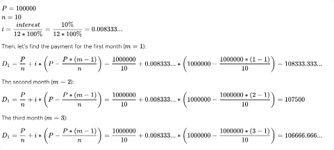

# Credit Calculator


### About this project
Finance is an important part of the life of any people. Sometimes you think about getting additional income and want to open a deposit account. And sometimes you need additional money right now and want to take a credit or mortgage. Anyway, you may want to calculate different financial indicators to make a decision. Let’s make such an instrument that can help us.

### Run

Requirements:
- Python 3.7
- To run the tests: https://github.com/hyperskill/hs-test-python

`python coffee_machine.py`


# Code it yourself: 

## 1. Beginning

#### Description
Let's think about what credit calculator should be able to do. In general, it takes several parameters like a credit principal and a credit interest, calculates the needed values (for example, monthly payment or overpayment) and outputs them.

Not familiar with these concepts? Don't worry, we will explain them to you in simple terms. The principal is the original amount of money you get on credit. And the interest is a charge for borrowed money, usually calculated as a percentage of such a loan.

#### Objective
Let's start by imitating this behavior. There are some prepared variables in source code that are ready for use: these are text messages that our credit calculator could output. At this stage, all you need to do is output them in the right order.

#### Example
Output:

```
Credit principal: 1000
Month 1: paid out 250
Month 2: paid out 250
Month 3: paid out 500
The credit has been repaid!
```

## 2. Dreamworld
#### Description
If you found the previous stage too easy, let's add something interesting. The best credits are probably those with a 0% interest: such credits are called installments.

Let's make some calculations for installments. The user might know the count of periods and want to calculate the monthly payment. Or, the user might know the value of the monthly payment and wonder how many periods it would take to repay the installments. 

At this stage, it is required to ask the user to input the credit principal. Then, the user should tell what needs to be calculated (the monthly payment or the count of periods) and enter the necessary parameter. After that, the credit calculator should output the value that the user wants.

Also, let’s assume we don't care about the digits after the dot. So if you get a floating-point expression as a result of the calculation, you’ll have to do additional actions. Take a look at Example 4. In that example, you need to calculate the monthly payment. You know that the credit principal is 1000 and want to pay fit in 9 months. The real value of payment can be calculated as:




Of course, you can’t pay that amount of money. You have to round up this value and make it 112. Remember that no payment can be more than a monthly payment. If you make a monthly payment of 111, the last payment will be 112, and if you make a monthly payment of 112, the last payment will be 104, which is appropriate by the rules. You can calculate the last payment just by:



At this stage, you need to count the number of months or the monthly payment. If the last payment differs from the rest, the program should display the monthly payment and the last payment.

#### Objectives
The behavior of your program should look like this:

1. Prompt a user to enter their credit principal and choose one of the two parameters, i.e. the count of periods or the monthly payment.
2. To perform further calculations, you'll also have to ask for the lacking value.
3. Finally, inform the user of your results.

#### Examples
The greater-than symbol followed by space (> ) represents the user input. Notice that it's not the part of the input.

Example 1:

```
Enter the credit principal:
> 1000
What do you want to calculate? 
type "m" - for count of months, 
type "p" - for monthly payment:
> m
Enter monthly payment:
> 150
 
It takes 7 months to repay the credit
```

Example 2:

```
Enter the credit principal:
> 1000
What do you want to calculate? 
type "m" - for count of months, 
type "p" - for monthly payment:
> m
Enter monthly payment:
> 1000
 
It takes 1 month to repay the credit
```

Example 3:

```
Enter the credit principal:
> 1000
What do you want to calculate? 
type "m" - for count of months, 
type "p" - for monthly payment:
> p
Enter count of months:
> 10
 
Your monthly payment = 100
```

Example 4:

```
Enter the credit principal:
> 1000
What do you want to calculate? 
type "m" - for count of months, 
type "p" - for monthly payment
> p
Enter count of months:
> 9
 
Your monthly payment = 112 with last month payment = 104.
```

## 3. Annuity payment

#### Description
Let's compute all the parameters of the credit. There are at least two kinds of credit: those with annuity payment and with differentiated payment. At this stage, you're going to calculate only the annuity payment which is fixed during the whole credit term.

This is the formula:

 

Where:

A = annuity payment

P = Credit principal.

i = nominal (monthly) interest rate. Usually, it’s 1/12 of the annual interest rate. And usually, it’s a floating value, not a percentage. For example, if you have annual interest rate = 12%, then i = 0.01.

n = Number of payments. Usually, it’s the count of months.

You are interested in four values: the count of periods to repay the credit, monthly payment, credit principal and credit interest. Each of these values can be calculated if others are known:

Credit principal:



A number of payments:



#### Objectives
At this stage, you should add new behavior to the calculator:

1. First, you should ask the user which parameter they want to calculate. The calculator should be able to calculate the count of periods, monthly payment and credit principal.
2. Then you need to ask them to input the remaining values.
3. Finally, compute and output the value that they wanted.

> Note that users input interest rate as a percentage, for example, 11.7, so you should divide this value by 100 to use in the formula above.

Please be accurate when converting "X months" to "Y years and Z months". Avoid writing "`0 years and 11 months`" (output "`11 months`" instead) and "`1 years and 0 months`" (output "`1 year`" instead).

Note that at this stage you have to ask the user to input parameters in a determined order which is provided below. Simply disregard the value the user wants to calculate from this order and follow it. For example, it can be monthly payment if the user typed “a” for the question “What do you want to calculate?”. Here is the order:

- The first is the credit principal. 

- The second is a monthly payment. 

- The next is the count of the period.

- The last is the credit interest.

#### Examples
The greater-than symbol followed by space (> ) represents the user input. Notice that it's not the part of the input.

Example 1:

```
What do you want to calculate? 
type "n" - for count of months, 
type "a" - for annuity monthly payment,
type "p" - for credit principal: 
> n
Enter credit principal: 
> 1000000
Enter monthly payment: 
> 15000
Enter credit interest:
> 10
You need 8 years and 2 months to repay this credit!
```

Let’s take a closer look at Example 1.

You know the credit principal, the credit interest and want to calculate the count of months. What shall you do?

1) You need to know the nominal interest rate. It is calculated like this:



2) Now you can calculate the count of periods:



3) You need integer count of periods, so let’s round it up. Notice that the user will pay a monthly payment for 97 months, and for 98th month the user will pay 0.71... of the monthly payment. So, there are 98 months to pay.

n = 98

4) Finally, you need to convert “98 months” to “8 years and 2 months”, so it is more readable and understandable for the user.

Consider other examples:

Example 2:

```
What do you want to calculate? 
type "n" - for count of months, 
type "a" - for annuity monthly payment,
type "p" - for credit principal: 
> a
Enter credit principal: 
> 1000000
Enter count of periods:
> 60
Enter credit interest:
> 10
Your annuity payment = 21248!
```

Example 3:

```
What do you want to calculate? 
type "n" - for count of months, 
type "a" - for annuity monthly payment,
type "p" - for credit principal: 
> p
Enter monthly payment: 
> 8721.8
Enter count of periods:
> 120
Enter credit interest:
> 5.6
Your credit principal = 800000!
```


## 4. Differentiate payment

#### Description
Finally, let's add to our calculator the capacity to compute the differentiated payment. In such a kind of payment where the part for reducing the credit principal is constant. Another part of the payment is for interest repayment and it reduces during the credit term. It means that the payment is different each month. Let’s look at the formula:



Where:

Dm = mth differentiated payment;

P = the credit principal;

i = nominal interest rate. Usually, it’s 1/12 of the annual interest rate. And usually, it’s a floating value, not a percentage. For example, if we our annual interest rate = 12%, then i = 0.01.

n = Number of payments. Usually, it’s the count of months.

m = current period.

As you can see, the user has to input a lot of parameters. So it might be convenient to use command-line arguments.

Suppose you used to run your credit calculator via command line like this:

```shell script
 python python credit_calc.py
```

Using command-line arguments you can run your program this way:

```shell script
python credit_calc.py --type=diff --principal=1000000 --periods=10 --interest=10
```

In that case, your program can get different values and not ask the user to input them. It can be useful when you are developing your program and trying to find a mistake and want to run the program with the same parameters again and again. Also, it's convenient if you made a mistake in a single parameter. You don't have to input all other values again.

To confidently work with command-line arguments in Python, check out a [tutorial](https://docs.python.org/3/howto/argparse.html).

#### Objectives
At this stage, it is required to implement these features:

- the calculation of differentiated payment. To do this, the user may run the program specifying interest, count of periods and credit principal.
- a capacity to calculate the same values as in the previous stage for annuity payment (principal, count of periods and value of the payment). A user specifies all known parameters with command-line arguments, while a single parameter will be unknown. This is the value the user wants to calculate.

- handling of invalid parameters. It's a good idea to show an error message Incorrect parameters in case of invalid parameters (they are discussed in detail below).

The final version of your program is supposed to work from the command line and parse the following parameters:

- `--type`, which indicates the type of payments: "`annuity`" or "`diff`" (differentiated). If `--type` is specified neither as "`annuity`" nor as "`diff`", or it is not specified at all, show the error message.

```shell script
python credit_calc.py --principal=1000000 --periods=60 --interest=10
Incorrect parameters
```

- `--payment`, that is a monthly payment. For `--type=diff` the payment is different each month, so we can't calculate periods or principal, therefore, its combination with `--payment` is invalid, too:

```shell script
python credit_calc.py --type=diff --principal=1000000 --interest=10 --payment=100000
Incorrect parameters
```

- `--principal` is used for calculations of both types of payment. You can get its value knowing the interest, annuity payment and periods.
- `--periods` parameter denotes the number of months and/or years needed to repay the credit. It's calculated based on the interest, annuity payment and principal.
- `--interest` is specified without a percent sign. Note that it may accept a floating-point value. Our credit calculator can't calculate the interest, so these parameters are incorrect:

```shell script
python credit_calc.py --type=annuity --principal=100000 --payment=10400 --periods=8
Incorrect parameters
```

Let's make a comment. You might have noticed that for differentiated payments you will need 4 out of 5 parameters (excluding payment), and the same is true for annuity payments (missing either periods, payment or principal). Thus, when less than four parameters are given, you should display the error message too:

```shell script
> python credit_calc.py --type=annuity --principal=1000000 --payment=104000
Incorrect parameters
```
Another case when you should output this message is negative values. We can't work with these!

```shell script
> python credit_calc.py --type=diff --principal=30000 --periods=-14 --interest=10
Incorrect parameters
```

Finally, don't forget to compute the value of overpayment, and you'll have your real credit calculator!

#### Examples
Let’s look at the first example. The greater-than symbol followed by space (> ) represents the user input. 

**Example 1:** _calculate differentiated payments_

```
> python credit_calc.py --type=diff --principal=1000000 --periods=10 --interest=10
Month 1: paid out 108334
Month 2: paid out 107500
Month 3: paid out 106667
Month 4: paid out 105834
Month 5: paid out 105000
Month 6: paid out 104167
Month 7: paid out 103334
Month 8: paid out 102500
Month 9: paid out 101667
Month 10: paid out 100834
 
Overpayment = 45837
```

In this example, the user wants to take a credit with differentiated payments. You know the principal, the count of periods and interest, which are 1,000,000, 10 months and 10% respectively.

The calculator should calculate payments for all 10 months. Let’s look at the formula above. In this case:



And so on. You can see other monthly payments above.

> Your credit calculator should output monthly payments for every month like at the first stage. Also, round up all floating-point values.

Finally, your credit calculator should add up all the payments and subtract the credit principal so that you'll get the overpayment.

**Example 2:** _find an annuity payment for the 60-month (or 5-year) credit with the principal 1,000,000 and 10% interest_

```
> python credit_calc.py --type=annuity --principal=1000000 --periods=60 --interest=10
Your annuity payment = 21248!
Overpayment = 274880
Example 3: less than four arguments are given

> python credit_calc.py --type=diff --principal=1000000 --payment=104000
Incorrect parameters.
```

**Example 4:** _calculate differentiated payments given the principal 500,000, the period of 8 months and the interest rate 7.8%_

```
> python credit_calc.py --type=diff --principal=500000 --periods=8 --interest=7.8
Month 1: paid out 65750
Month 2: paid out 65344
Month 3: paid out 64938
Month 4: paid out 64532
Month 5: paid out 64125
Month 6: paid out 63719
Month 7: paid out 63313
Month 8: paid out 62907
 
Overpayment = 14628
```

**Example 5:** _calculate the principal for a user paying 8,722 per month for 120 months (10 years) with the interest 5.6%_

```
> python credit_calc.py --type=annuity --payment=8722 --periods=120 --interest=5.6
Your credit principal = 800018!
Overpayment = 246622
```

**Example 6:** _figure out how much time a user needs to repay the credit with 500,000 principal, 23,000 monthly payment and 7.8% interest_

```
> python credit_calc.py --type=annuity --principal=500000 --payment=23000 --interest=7.8
You need 2 years to repay this credit!
Overpayment = 52000
```

python creditcalc.py -h
python creditcalc.py --type=diff --principal=500000 --periods=8 --interest=7.8
python creditcalc.py --type=annuity --payment=8722 --periods=120 --interest=5.6
python creditcalc.py --type=annuity --principal=500000 --payment=23000 --interest=7.8