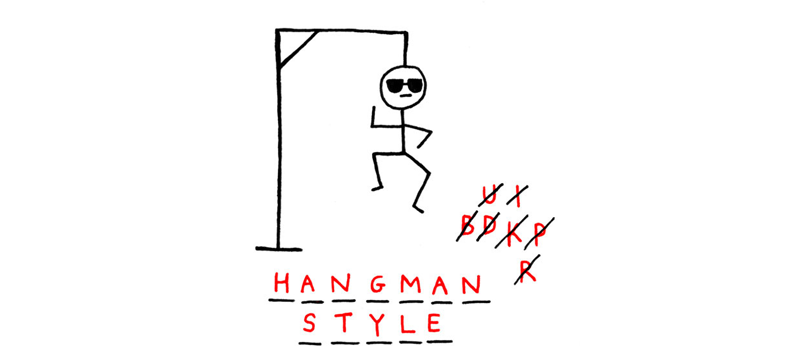

# Hangman

### About this project
<strong>Hangman</strong> is a popular yet grim intellectual game. A cruel computer hides a word from you. Letter by letter you try to guess it. If you fail, you'll be hanged, if you win, you'll survive. See also: <a target="_blank" href="https://en.wikipedia.org/wiki/Hangman_(game)" rel="nofollow noopener noreferrer">Wikipedia</a>

In this game the player has to guess a word, letter by letter, in a limited number of attempts. 
Make a program that plays Hangman with you – and good luck with the guessing!

### Run

Requirements:
- Python 3.7
- To run the tests: https://github.com/hyperskill/hs-test-python

`python hangman.py`

# Code it yourself: 
## 1. Hello, Hangman

You probably played the game at least once in your life; now you can actually create this game yourself!

<h4>Description</h4>

Let's have a brief overview of what you are going to build during this project. Here is what the gameplay should look like:

<ol>
	<li>In the main menu, a player can choose to either play or exit the game;</li>
	<li>If the user chooses to play, the computer picks a word from a list: this will be the riddle;</li>
	<li>The computer asks the player to enter a letter that (s)he thinks is in the word;</li>
	<li>If there's no such letter in the word and this letter hasn't been tried before, the computer counts it as a miss. A player can afford only up to 8 misses before the game is over;</li>
	<li>If the letter does occur in the word, the computer notifies the player. If there are letters left to guess, the computer invites the player to go on.</li>
	<li>When the entire word is uncovered, it's a victory! The game calculates the final score and goes back to the main menu.</li>
</ol>

It may sound complex, but the project is split into small stages with hints to see you through. The final product is sure to be replayable and quite engaging!

Let's start with an announcement that will greet the player. You already know how to print something using Python: try to apply your knowledge to intrigue your friends with your game announcement!

<h4>Objectives</h4>

In this stage you should <strong>write a program </strong>that prints the lines as shown in the example below:

<h4>Example </h4>

Output:

<pre><code class="language-no-highlight">H A N G M A N
The game will be available soon.</code></pre>

## 2. I want to play a game
<h4>Description</h4>

At this stage, you will create a real game. It will be simple, but there will be two possible outcomes (you can see in the examples below how they look like). Let's first print a welcome message and then ask a player to guess the word we set for the game. If our player manages to guess the exact word, the game reports "win"; otherwise it will "hang" the player.

<h4>Objectives</h4>

<ol>
	<li>Ask a player for a possible word.</li>
	<li>Print <code class="java">You survived!</code> if the user guessed the word.</li>
	<li>Print <code class="java">You are hanged!</code> if the user haven't guessed the word</li>
</ol>

By the way, the word <code class="java">python</code> should be the correct word to win the game.

<h4>Examples</h4>

The greater-than symbol followed by space (<code class="java">&gt; </code>) represents the user input. Notice that it's not the part of the input.

<strong>Example 1</strong>

<pre><code class="language-no-highlight">H A N G M A N
Guess the word: &gt; python
You survived!</code></pre>

<strong>Example 2</strong>

<pre><code class="language-no-highlight">H A N G M A N
Guess the word: &gt; java
You are hanged!</code></pre>

## 3. Make your choice

<h4>Description</h4>

If there is a predefined word, the game isn't replayable: you already know the word, so it makes no sense to guess it. At this stage, let's make the game more challenging by choosing a word from a special list with a variety of options. This way, our game won't be just a one-time entertainment.

<h4>Objectives</h4>

<ol>
	<li>Create the following word list: <code class="java">'python', 'java', 'kotlin', 'javascript'</code>.</li>
	<li>Program the game to choose a random word from it. You can enter more words, but let's stick to these four for now.</li>
</ol>

<h4>Examples</h4>

The greater-than symbol followed by space (<code class="java">&gt; </code>) represents the user input. Notice that it's not the part of the input.

<strong>Example 1, </strong><em> the computer randomly chose <code class="java">python</code> from the list.</em>

<pre><code class="language-no-highlight">H A N G M A N
Guess the word: &gt; python
You survived!</code></pre>

<strong>Example 2, </strong><em>the computer randomly chose something other than <code class="java">python</code> from the list.</em>

<pre><code class="language-no-highlight">H A N G M A N
Guess the word: &gt; python
You are hanged!</code></pre>

<strong>Example 3, </strong><em>the computer randomly chose something other than <code class="java">kotlin</code> from the list.</em>

<pre><code class="language-no-highlight">H A N G M A N
Guess the word: &gt; kotlin
You are hanged!</code></pre>

## 4. Help is on the way

<h4>Description</h4>

Now our game has become quite hard, and your chances of guessing the word depend on the size of the list. In our case with four words, there is only a 25% chance, so let's have mercy on the player and add a hint for them.

<h4>Objectives</h4>

<ol>
	<li>As in the previous stage, you should use the following word list: <code class="java">'python', 'java', 'kotlin', 'javascript'</code></li>
	<li>Show the <strong>first 3 letters</strong> after the computer chose a word from the list. Hidden letters should be replaced with hyphens (<code class="java">"-"</code>).</li>
</ol>

<h4>Examples</h4>

The greater-than symbol followed by space (<code class="java">&gt; </code>) represents the user input. Notice that it's not the part of the input.

<strong>Example 1</strong>

<pre><code class="language-no-highlight">H A N G M A N
Guess the word jav-: &gt; java
You survived!</code></pre>

<strong>Example 2</strong>

<pre><code class="language-no-highlight">H A N G M A N
Guess the word pyt---: &gt; pythia
You are hanged!</code></pre>

## 5. Keep trying

<h4>Description</h4>

Let's make the game iterative. It's time to make it resemble the classical Hangman a bit more: a player should guess letters in the word instead of typing the entire word at once. If the player guesses a letter, it should be uncovered in the word. For now, start with the defeat case and add 8 tries to guess a letter that appears in the word. When the player runs out of attempts, the game ends.

Later we will determine the winning conditions, but in this stage, let's see how well our player guesses the word on every attempt.

<h4>Objectives</h4>

Now your game should work the following way:

<ol>
	<li>A player has <strong>exactly 8 tries</strong> and enters letters. If a player has more tries but he actually guessed the word, it doesn't mean anything.</li>
	<li>If the letter doesn't occur in the word, the computer takes one try away, even if the user already inputted this letter before.</li>
	<li>If the player doesn't have any more attempts, the game should end and the program should show a losing message. Otherwise, the player can continue to input letters.</li>
	<li>Also, use our  previous word list: <code class="java">'python', 'java', 'kotlin', 'javascript'</code> so that your program can be tested more reliably.</li>
</ol>

Please, make sure that your program's output formatting precisely follows the example output formatting. Pay attention to the empty lines between tries and in the end.

<h4>Examples</h4>

The greater-than symbol followed by space (<code class="java">&gt; </code>) represents the user input. Notice that it's not the part of the input.

<strong>Example 1</strong>

<pre><code class="language-no-highlight">H A N G M A N

----------
Input a letter: &gt; a

-a-a------
Input a letter: &gt; i

-a-a---i--
Input a letter: &gt; o
No such letter in the word

-a-a---i--
Input a letter: &gt; z
No such letter in the word

-a-a---i--
Input a letter: &gt; p
No such letter in the word

-a-a---ip-
Input a letter: &gt; p

-a-a---ip-
Input a letter: &gt; h
No such letter in the word

-a-a---ip-
Input a letter: &gt; k
No such letter in the word

Thanks for playing!
We'll see how well you did in the next stage</code></pre>

<strong>Example 2</strong>

<pre><code class="language-no-highlight">H A N G M A N

----
Input a letter: &gt; j

j---
Input a letter: &gt; i
No such letter in the word

j---
Input a letter: &gt; g
No such letter in the word

j---
Input a letter: &gt; o
No such letter in the word

j---
Input a letter: &gt; a

ja-a
Input a letter: &gt; v

java
Input a letter: &gt; a

java
Input a letter: &gt; j

Thanks for playing!
We'll see how well you did in the next stage</code></pre>

## 6. The value of life

<h4>Description</h4>

The recent version of the game is not as fun until we don't handle the player's victory. A player has 8 attempts to guess letters and its number is reduced even if the letter was correct.

Now a player will have a lot of attempts and is limited only by the number of mistakes they make. A player can be mistaken 8 times and wins when <strong>all</strong> the letters are guessed and there are still some tries left. If the player uses the last try and actually guesses the word, they are lucky then!

<h4>Objectives</h4>

The player starts the game with 8 "lives", that is our player can input the wrong letter 8 times.

<ol>
	<li>Print <code class="java">No such letter in the word</code> and reduce the attempts count if the word guessed by the program doesn't contain this letter.</li>
	<li>Print <code class="java">No improvements</code> and reduce the attempts count if the guessed word contains this letter but the user tried this letter before.</li>
	<li>The attempts count should be decreased <strong>only</strong> if there are no letters to uncover.</li>
</ol>

Please, make sure that your program's output formatting precisely follows the example output formatting. Pay attention to the empty lines between tries and in the end.

<h4>Examples</h4>

The greater-than symbol followed by space (<code class="java">&gt; </code>) represents the user input. Notice that it's not the part of the input.

<strong>Example 1</strong>

<pre><code class="language-no-highlight">H A N G M A N

------
Input a letter: &gt; t

--t---
Input a letter: &gt; z
No such letter in the word

--t---
Input a letter: &gt; t
No improvements

--t---
Input a letter: &gt; t
No improvements

--t---
Input a letter: &gt; y

-yt---
Input a letter: &gt; x
No such letter in the word

-yt---
Input a letter: &gt; y
No improvements

-yt---
Input a letter: &gt; p

pyt---
Input a letter: &gt; p
No improvements

pyt---
Input a letter: &gt; q
No such letter in the word

pyt---
Input a letter: &gt; p
No improvements
You are hanged!</code></pre>

<strong>Example 2</strong>

<pre><code class="language-no-highlight">H A N G M A N

----
Input a letter: &gt; j

j---
Input a letter: &gt; i
No such letter in the word

j---
Input a letter: &gt; g
No such letter in the word

j---
Input a letter: &gt; g
No such letter in the word

j---
Input a letter: &gt; g
No such letter in the word

j---
Input a letter: &gt; g
No such letter in the word

j---
Input a letter: &gt; a

ja-a
Input a letter: &gt; v

java
You guessed the word!
You survived!</code></pre>

## 7. Error!

<h4>Description</h4>

Now that we are done with the basics, let's work on some details.

In the previous stage if the user entered the same letter twice or typed a cyrillic letter, the program reduced the number of attempts regardless if this was a correct letter or not. But it is not fair to the user, isn't it? He gains no additional information about the situation on the field yet the program still reduces his attempts count. Let's fix it!

<h4>Objectives</h4>

<ol>
	<li>If the user enters the same letter twice then the program should output <code class="java">You already typed this letter</code> .</li>
	<li>Also, you should check if the user prints an English lowercase letter or not. If not, the program should print <code class="java">It is not an ASCII lowercase letter</code> . </li>
	<li>Also, you should check if the user printed exactly one letter. If not, the program should print <code class="java">You should input a single letter</code> . Remember that zero is also not one!</li>
	<li>Note that all these three errors should not reduce attempts count!</li>
</ol>

Please, make sure that your program's output formatting precisely follows the example output formatting. Pay attention to the empty lines between tries and in the end.

<h4>Examples</h4>

The greater-than symbol followed by space (<code class="java">&gt; </code>) represents the user input. Notice that it's not the part of the input.

<strong>Example 1</strong>

<pre><code class="language-no-highlight">H A N G M A N

----------
Input a letter: &gt; a

-a-a------
Input a letter: &gt; i

-a-a---i--
Input a letter: &gt; o
No such letter in the word

-a-a---i--
Input a letter: &gt; o
You already typed this letter

-a-a---i--
Input a letter: &gt; p

-a-a---ip-
Input a letter: &gt; p
You already typed this letter

-a-a---ip-
Input a letter: &gt; h
No such letter in the word

-a-a---ip-
Input a letter: &gt; k
No such letter in the word

-a-a---ip-
Input a letter: &gt; a
You already typed this letter

-a-a---ip-
Input a letter: &gt; z
No such letter in the word

-a-a---ipt
Input a letter: &gt; t

-a-a---ipt
Input a letter: &gt; x
No such letter in the word

-a-a---ipt
Input a letter: &gt; b
No such letter in the word

-a-a---ipt
Input a letter: &gt; d
No such letter in the word

-a-a---ipt
Input a letter: &gt; w
No such letter in the word
You are hanged!</code></pre>

<strong>Example 2</strong>

<pre><code class="language-no-highlight">H A N G M A N

----
Input a letter: &gt; j

j---
Input a letter: &gt; i
No such letter in the word

j---
Input a letter: &gt; +
It is not an ASCII lowercase letter

j---
Input a letter: &gt; A
It is not an ASCII lowercase letter

j---
Input a letter: &gt; ii
You should input a single letter

j---
Input a letter: &gt; ++
You should input a single letter

j---
Input a letter: &gt;
You should input a single letter

j---
Input a letter: &gt; g
No such letter in the word

j---
Input a letter: &gt; a

ja-a
Input a letter: &gt; v
You guessed the word java!
You survived!</code></pre>

## 8. Menu, please 

<h4>Description</h4>

We're almost done!

Let's add more flavor to the game by adding a suggestion to replay after the current game session ends.

<h4>Objectives</h4>

<ol>
	<li>The game starts with a menu where a player can choose to either play or exit.</li>
	<li>Print <code class="java">Type "play" to play the game, "exit" to quit:</code> and ask again if the player inputs something else.</li>
	<li>If the user chooses to play, the game starts.</li>
</ol>

Please, make sure that your program's output formatting precisely follows the example output formatting. Pay attention to the empty lines between tries and in the end.

<h4>Example</h4>

The greater-than symbol followed by space (<code class="java">&gt; </code>) represents the user input. Notice that it's not the part of the input.

<pre><code class="language-no-highlight">H A N G M A N
Type "play" to play the game, "exit" to quit: &gt; play

----------
Input a letter: &gt; a

-a-a------
Input a letter: &gt; i

-a-a---i--
Input a letter: &gt; o
No such letter in the word

-a-a---i--
Input a letter: &gt; o
You already typed this letter

-a-a---i--
Input a letter: &gt; p

-a-a---ip-
Input a letter: &gt; p
You already typed this letter

-a-a---ip-
Input a letter: &gt; h
No such letter in the word

-a-a---ip-
Input a letter: &gt; k
No such letter in the word

-a-a---ip-
Input a letter: &gt; a
You already typed this letter

-a-a---ip-
Input a letter: &gt; z
No such letter in the word

-a-a---ipt
Input a letter: &gt; t

-a-a---ipt
Input a letter: &gt; x
No such letter in the word

-a-a---ipt
Input a letter: &gt; b
No such letter in the word

-a-a---ipt
Input a letter: &gt; d
No such letter in the word

-a-a---ipt
Input a letter: &gt; w
No such letter in the word
You are hanged!

Type "play" to play the game, "exit" to quit: &gt; exit</code></pre>
