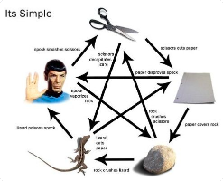
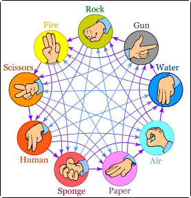

# ✊🏽 Rock ✋🏽️ Paper ✌🏽 Sissors


### About this project
 In this project you will code a Rock-Paper-Scissors-Lizard-Spock game, a more advanced version of Rock-Paper-Scissors, which can be played against the computer.


### Run

Requirements:
- Python 3.7
- To run the tests: https://github.com/hyperskill/hs-test-python

`python game.py`


# Code it yourself: 

## 1: Unfair computer

### Description

Rock, paper, scissors is a well-known hand game. Each one of two players simultaneously forms one of three shapes with their hands, and then, depending on the chosen shapes, the winner is determined: rock beats scissors, paper wins over rock, scissors beat paper. 
The game is widely used to make a fair decision between equal options.

So, let's start with an unfair version! :)

Write a program that reads input specifying which option the user has chosen. Then your program should make the user lose! That is, your program should always choose an option that defeats the one picked by the user. After finding this option, output a line `Sorry, but computer chose option`, where `<option>` is the name of option that the program picked depending on the user's input.
For example, if the user enters `rock`, the program should print `Sorry, but computer chose paper` and so on.

### Objectives

Your program should:

Take an input from the user
Find an option that wins over the user's option
Output a line: Sorry, but computer chose `option`

### Examples

The greater-than symbol followed by space (> ) represents the user input. Notice that it's not the part of the input.

Example 1

```
> scissors
Sorry, but computer chose rock
```

Example 2

```
> paper
Sorry, but computer chose scissors
```

## 2. Equalizing chances

### Description
Well, now let's do something real. Nobody wants the game where you always lose.
Using the power of the `random` module, we'll make a truly interesting game.

You should write a program that reads input from the user, chooses a random option and then says who won, the user or the computer.
There are a few examples below, providing output for any outcome (`<option>` is the option chosen by your program):

1. Lose -> `Sorry, but computer chose <option>`
2. Draw -> `There is a draw (<option>)`
3. Win -> `Well done. Computer chose <option> and failed`

### Objectives
Your program should:

1. Read user's input specifying the option that user has chosen
2. Choose a random option
3. Compare the options and determine the winner
4. Output a line depending on the result of the game:
    - Lose -> `Sorry, but computer chose <option>`
    - Draw -> `There is a draw (<option>)`
    - Win -> `Well done. Computer chose <option> and failed`

### Examples
The greater-than symbol followed by space (> ) represents the user input. Notice that it's not the part of the input.

Example 1
```
> rock
Well done. Computer chose scissors and failed
```

Example 2
```
> scissors
There is a draw (scissors)
```

Example 3
```
> paper
Sorry, but computer chose scissors
```

## 3. Endless game
### Description
Wasn't that pretty cool?

But the game is really short so far: nobody plays just a single shot of rock-paper-scissors. We need to do some literally unstoppable game for unstoppable players. Not literally unstoppable, of course: let's implement a way to stop your program.

Improve your program so it would take an unlimited number of inputs until the user enters `!exit`. After entering `!exit` the program should print `Bye!` and terminate. Also, let's try to handle invalid inputs: your program should be ready that there may be a typo in user's input, or that a user may just enter complete gibberish instead of a normal command. So, in case the input doesn't correspond to any known command (option name or `!exit`), your program should output the line `Invalid input`

### Objectives
Your program should:

1. Take an input from the user
2. If the input is `!exit`, output `Bye!` and stop the game
3. If the input is the name of the option, then:
4. Pick a random option
5. Output a line with the result of the game in the following format (`<option>` is the name of the option chosen by the program):
    - Lose -> `Sorry, but computer chose <option>`
    - Draw -> `There is a draw (<option>)`
    - Win -> `Well done. Computer chose <option> and failed`
6. If the input corresponds to anything else, output `Invalid input`
7. Do it all over again

### Example
The greater-than symbol followed by space (> ) represents the user input. Notice that it's not the part of the input.

```shell script
> rock
Well done. Computer chose scissors and failed
> paper
Well done. Computer chose rock and failed
> paper
There is a draw (paper)
> scissors
Sorry, but computer chose rock
> rokc
Invalid input
> xit!
Invalid input
> !exit
Bye!
```

## 4. Scoring the Game
### Description
People love to see their results as they're running to their goal.
So, let's learn how to show the user the score of the game. 

When the game starts, the user should enter his/her name. After that, the program should greet the user and read a file named `rating.txt` . This is a file containing current scores for different players. You can see the file format below: it's just lines containing user's name and his/her score divided by a single space.

```text
Tim 350
Jane 200
Alex 400
```

If there’s a record for the user with the same name in the file, the program should take his/her rating and use it as a reference point for counting current user’s score (for example, if the user entered name Tim, then his score at the start of the game will be 350). If the user's name isn't written in the file, then your program should count user's score from 0. 

You don't need to write anything in the `rating.txt` file!

The program should print user's score when the user enters `!rating`. For example, if your rating is 0 then the program should print:

`Your rating: 0`

Your program should add 50 points to the player for every draw, 100 for every win, and nothing for losing.

### Objectives
Your program should:

1. Output a line `Enter your name: `. Note that the user should enter his/her name on the same line (not the one following the output!)
2. Read input specifying the user's name and output a new line `Hello, <name>`
3. Read a file named `rating.txt` and check if there's a record for the user with the same name; if yes, use the score specified in the `rating.txt` for this user as a starting point for calculating the score in the current game. If no, start counting user's score from 0.
4. Play the game by the rules defined on the previous stages:
5. Read user's input
6. If the input is `!exit`, output `Bye!` and stop the game
7. If the input is the name of the option, then:
8. Pick a random option
9. Output a line with the result of the game in the following format (`<option>` is the name of the option chosen by the program):
    - Lose -> `Sorry, but computer chose <option>`
    - Draw -> `There is a draw (<option>)`
    - Win -> `Well done. Computer chose <option> and failed`
10. For each draw, add 50 point to the score. For each user's win, add 100 to his/her score. In case the user loses, don't change the score. 
11. If the input corresponds to anything else, output Invalid input
12. Play the game again

### Examples
The greater-than symbol followed by space (> ) represents the user input. Notice that it's not the part of the input.

Example 1
```
Enter your name: > Tim
Hello, Tim
> !rating
Your rating: 350
> rock
Sorry, but computer chose paper
> paper
Well done. Computer chose rock and failed
> scissors
There is a draw (scissors)
> !rating
Your rating: 500
> !exit
Bye!
```
Example 2
```
Enter your name: > Chuck
Hello, Chuck
> scissors
There is a draw (scissors)
> rock
Well done. Computer chose scissors and failed
> paper
Well done. Computer chose rock and failed
> !rating
Your rating: 250
> !exit
Bye!
```

## 5. More options
### Description
How about some brand new rules? The original game has a fairly small choice of options.

Extended versions of the game are decreasing the probability of draw, so it could be cool to play them.



Now, your program should be able to accept an alternative lists of options, like Rock, Paper, Scissors, Lizard, Spock, or even a list like this:



At this stage, before the start of the game the user will be able to choose the options that will be used. After entering his/her name, the user should provide a list of options separated by comma. For example, 

`rock,paper,scissors,lizard,spock`

If the user inputs an empty line, your program should start the game with default options: rock. paper and scissors. 

After the game options are defined, your program should output `Okay, let's start`

Whatever list of options the user chooses, your program, obviously, should be able to identify which option beats which, that is, the relationships between different options. First, every option is equal to itself (causing a draw if both user and computer choose the same option). Secondly, every option wins over one half of the other options of the list, and gets defeated by another half. How to determine which options are stronger or weaker that the option you're currently looking at? Well, you can try to do it this way: take the list of options (provided by the user of the default one). Find the option for which you want to know its relationships with other options. Take all the options that follow this chosen option in the list. Add to them the list of options that precede the chosen option. Now you have another list of options that doesn't include the "chosen" option and has the different order of elements in it (first go the options following the chosen one in the original list, after them are the ones that precede it). So, in this "new" list, the first half of options will be defeating the "chosen" option, and the second half will get beaten by it. 

For example, the user's list of options is `rock,paper,scissors,lizard,spock`. You want to know what options are weaker than `lizard`. By looking at the list `spock,rock,paper,scissors` you realize that `spock` and `rock` will be beating the `lizard`, and `paper` and `scissors` will get defeated by it. For `spock` it'll be almost the same, but it'll get beaten by `rock` and `paper`, and prevail over `scissors` and `lizard`. For the version of the game with 15 options, you can look at the picture above to understand the relationships between options. 

Of course, this is not the most efficient way to determine which option prevails over which. You are welcome to try to develop some other methods of tackling this problem. 

### Objectives
Your program should:

1. Output a line `Enter your name:` . Note that the user should enter his/her name on the same line (not the one following the output!)
2. Read input specifying the user's name and output a new line `Hello, <name>`
3. Read a file named `rating.txt` and check if there's a record for the user with the same name; if yes, use the score specified in the `rating.txt` for this user as a starting point for calculating the score in the current game. If no, start counting user's score from 0.
4. Read input specifying the list of options that will be used for playing the game (options are separated by comma). If the input is an empty line, play with default options. 
5. Output a line `Okay, let's start`
6. Play the game by the rules defined on the previous stages:
7. Read user's input
8. If the input is `!exit`, output `Bye!` and stop the game
9. If the input is the name of the option, then:
10. Pick a random option
11. Output a line with the result of the game in the following format (`<option>` is the name of the option chosen by the program):
    - Lose -> `Sorry, but computer chose <option>`
    - Draw -> `There is a draw (<option>)`
    - Win -> `Well done. Computer chose <option> and failed`
12. For each draw, add 50 point to the score. For each user's win, add 100 to his/her score. In case the user loses, don't change the score. 
13. If the input corresponds to anything else, output `Invalid input`
14. Play the game again (with the same options that were defined before the start of the game)

### Example
The greater-than symbol followed by space (> ) represents the user input. Notice that it's not the part of the input.

Example 1:
```shell script
Enter your name: > Tim
Hello, Tim
> rock,gun,lightning,devil,dragon,water,air,paper,sponge,wolf,tree,human,snake,scissors,fire
Okay, let's start
> rock
Sorry, but computer chose air
> !rating
Your rating: 0
> rock
Well done. Computer chose sponge and failed
> !rating
Your rating: 100
> !exit
Bye!
```

Example 2: 
```shell script
Enter your name: > Tim
Hello, Tim
> 
Okay, let's start
> rock
Well done. Computer chose scissors and failed
> paper
Well done. Computer chose rock and failed
> paper
There is a draw (paper)
> scissors
Sorry, but computer chose rock
> !exit
Bye!
```

